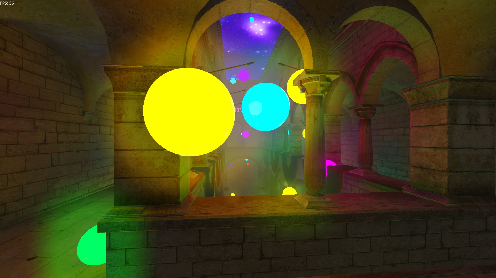

# Hackathon 2023 Music Visualiser

**[Click here to see a video of the visualiser in action!](https://www.dropbox.com/scl/fi/smt4flmb2jd6qx4vymkme/2023-08-27-05-26-09.mp4?rlkey=lw0myi72nwesx68pvj072k8gw&dl=0)**

This implements a music visualiser using Godot 4. A bunch of spheres with emissive
lights are drawn around a globally illuminated scene, and the size of the spheres is synchronised
based on the frequency spectrum of the song. The spheres change colour every bar (based on the BPM),
and there is a chromatic abberation effect at certain intervals in the song, e.g. the drop.

We were also aiming to capture a 3D scan of the Advanced Engineering Building at UQ using an Intel
RealSense depth camera, then use dense SLAM to reconstruct it into a 3D model, and import the
model into the game. This would then sort of be like AR, as the emissive lights would illuminate
the real world. Unfortunately, the SLAM we were using from Open3D did not produce acceptable results,
so next year we'll use a more advanced SLAM solutions that integrates the RealSense's IMU, or use
photogrammetry via MeshRoom.

The song used is: [T17 by Corporate](https://soundcloud.com/playmerecords/corporate-t17-original-mix) (you
should listen and save, it rocks)

This project was completed in 48 hours as part of the UQCS Hackathon 2023 at UQ, but unfortunately didn't
win anything.

**Team members of Team "The Opps Took My Global Illumination":**
- Matt Young: Godot visualisation, Global illumination enjoyer
- Jordy Davies: Mesh reconstruction, GIMP enthusiast

**Some more notes from Matt**

As correctly picked out by just one person (big ups to her), the goal of the project is to create
a more "grounded" music visualiser, and eventually one that can bring music to life in a _real_ space.
If you're familiar with existing visualisers like [projectM](https://github.com/projectM-visualizer/projectm)
or [MilkDrop](https://en.wikipedia.org/wiki/MilkDrop), they look nice but are very "abstract" - they are shader
effects, and don't occupy a real 3D volume. The idea of the glowing orbs swirling around came to my on a
walk, but I think I took some inspiration from the [ending scene of Sunshine (2007)](https://youtu.be/UY5tjbpuHQI?t=59),
where glowing orbs of energy engulf Cillian Murphy. With the addition of volumetric fog and a night skybox,
the space is also designed to look "dreamy" - maybe like an alternate dimension or something - but still
grounded in reality to some extent.

If we are at the next Hackathon, our goal will be first and foremost to capture a usable scan of a building
at UQ or use AR effects. We will probably bring a similar concept, although I want to iterate a bit more
on the animation of the spheres. Syncing them to frequency blocks is easy, but it doesn't look as good as
it probably could if it used tempo-based animation instead. We may also use a different approach to visualising
than the spheres, I think it looked good but it's always good to come up with new stuff. I'd also like to 
iterate on some graphical effects more - specifically using Godot's VoxelGI rather than the SDFGI screen-space 
approximation.

Anyway, that's about it. I hope you enjoy this project!

## Licence
Mozilla Public License v2.0
