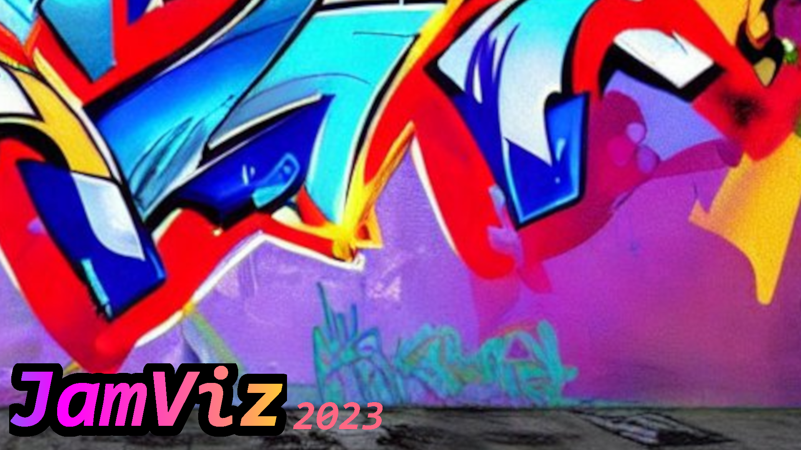

# Hackathon 2023 Music Visualiser

This implements a music visualiser using Godot 4. A bunch of spheres with emissive
lights are drawn around a globally illuminated scene, and the size of the spheres is synchronised
based on the frequency spectrum of the song. There are also some effects based on the BPM the song
as well.

We are also aiming to capture a 3D scan of the Advanced Engineering Building at UQ using an Intel
RealSense depth camera, then use dense SLAM to reconstruct it into a 3D model, and import the
model into the game. This would then sort of be like AR, as the emissive lights would illuminate
the real world.

The song used is: [T17 by Corporate](https://soundcloud.com/playmerecords/corporate-t17-original-mix)

**Team members:**
- Matt Young: Godot visualiser
- Jordy Davies: Mesh reconstruction

## Licence
Mozilla Public License v2.0
